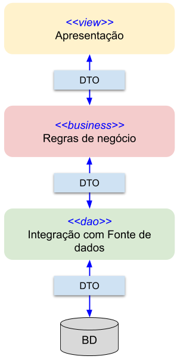
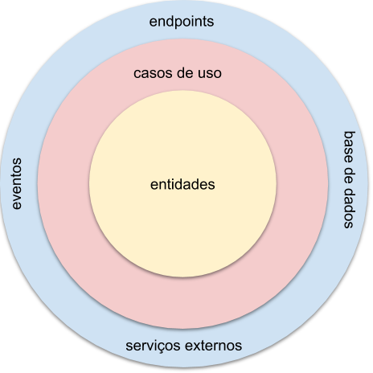

# POC Clean Architecture 

## Contexto

Como pessoas profissionais desenvolvedoras de software, econtramos uma estrutura de camadas na maioria das aplicações que trabalhamos. 
A camada superior chamamos de _view_, _presenter_ ou qualquer coisa que seja similar a isso. Generalizando, vou chamar de camada de _apresentação_.

Logo abaixo da camada de apresentação está a camada onde colocamos as _regras de negócio_, e chamamos de _business_, _service_ ou coisa parecida. 

A última camada é a de acesso às _fontes de dados_, geralmente bases de dados em SGBDs, comumente chamada de _dal_ ou _dao_. 

Entre essas camadas transita uma estrutura de dados comum, um "objeto" com seus atributos e modos de acesso. 

Esta estrutura não reforça o encapsulamento. Pelo contrário, quebra o encapsulamento. Temos _dados_(DTO) e as _ações sobre os dados_(camadas) em estruturas diferentes.
Assim, é comum que algumas funcionalidades estejam repetidas por toda a aplicação que lida com esses DTOs. Este modelo também é conhecido como modelo anêmico.

## Arquitetura Limpa

Também conhecido como Onion Architecture, Hexagonal Architecture ou Ports and Adapters, a ideia aqui é isolar os componentes 
críticos do sistema em seu núcleo. O modelo abaixo demonstra melhor a ideia. 

Aqui promovemos o uso de Single Responsibility Principle, que estabelece que componentes de software devem atender a um e somente um _ator_. 
No modelo anterior, os casos de uso e as entidades atendem às pessoas de negócio, pois contém os processos pertinentes ao negócio. O anel exterior
atende às pessoas de tecnologia, pois é aí que estão os vínculos principais com bibliotecas, ferramentas, _frameworks_ e etc.

Portanto, nas camadas de casos de uso e entidades, não pode haver nada de contexto de tecnologia, em outras palavras, o bom e velho java (nesse exemplo), 
sem anotações de _frameworks_ de persistência ou de comunicação externa. O contrário deve ser dito do anel exterior, onde o foco são as tecnologias, e 
não deve conter nenhuma regra de negócio (a não ser orquestração de funcionalidades). 

  